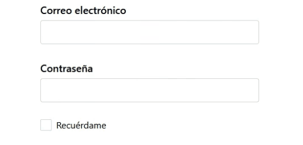

# JWT Login

## Configurar JWT Token

### Paso 1: Descargar el Bundle

Añadimos el bundle [LexikJWTAuthenticationBundle](https://github.com/lexik/LexikJWTAuthenticationBundle):

```console
composer require lexik/jwt-authentication-bundle
```
Este paquete proporciona autenticación JWT (Json Web Token) para tu API de Symfony.

### Paso 2: Generar las claves SSL

```console
php bin/console lexik:jwt:generate-keypair
```

Sus claves aterrizarán en `config/jwt/private.pem` y `config/jwt/public.pem` (a menos que haya configurado una ruta diferente).

Opciones Disponibles:

* `--skip-if-exists` no hará nada en silencio si las claves ya existen.
* `--overwrite` sobrescribirá sus claves si ya existen.

De lo contrario, se generará un error para evitar que sobrescriba sus claves accidentalmente.

### Paso 3: Configurar la ruta de las claves SSL

Configure la ruta de las claves SSL y la frase de contraseña en su `.env`:

```diff
#.env

+JWT_SECRET_KEY=%kernel.project_dir%/config/jwt/private.pem
+JWT_PUBLIC_KEY=%kernel.project_dir%/config/jwt/public.pem
+JWT_PASSPHRASE=my_jwt_passphrase
```

### Paso 4: Configurar lexik_jwt_authentication.yaml

Configure su `config/packages/security.yaml`:

```yaml
# config/packages/lexik_jwt_authentication.yaml

lexik_jwt_authentication:
    secret_key: '%env(resolve:JWT_SECRET_KEY)%'
    public_key: '%env(resolve:JWT_PUBLIC_KEY)%'
    pass_phrase: '%env(JWT_PASSPHRASE)%'
    token_ttl: 3600

#>only for jwt cookies
    token_extractors:
        split_cookie:
            enabled: true
            cookies:
                - jwt_hp
                - jwt_s
    set_cookies:
        jwt_hp:
            lifetime: null
            samesite: strict
            path: /
            domain: null
            httpOnly: false
            split:
                - header
                - payload
        jwt_s:
            lifetime: null
            samesite: strict
            path: /
            domain: null
            httpOnly: true
            split:
                - signature
#<only for jwt cookies 
```

### Paso 5: Crear nueva ruta

Configuramos el enrutamiento en `config/routes.yaml`:

```yaml
#config/routes.yaml

#...
api_auth_login:
  path: /api/auth/login
#...
```

### Paso 6: Configurar security.yaml

Configure su `config/packages/security.yaml`:

```yaml
#config/packages/security.yaml

security:
    enable_authenticator_manager: true
    #...
    providers:
        app_user_provider:
            entity:
                class: App\Entity\User
    #...
    firewalls:
        #...
        main:
            pattern: ^/api/
            stateless: true
            provider: app_user_provider
            entry_point: jwt
            json_login:
                check_path: /api/auth/login
                username_path: userIdentifier
                password_path: password
                success_handler: lexik_jwt_authentication.handler.authentication_success
                failure_handler: lexik_jwt_authentication.handler.authentication_failure
            jwt: ~
            #...
    #...
```

## Añadir "recuérdame"

Añadir la opción de mantener al usuario recordado, es decir, aumentar la vida del token si el usuario a marcado el campo "recuérdame" en el formulario de login:

<p align="left">
    
</p>

Para alterar la vida del Token, escucharemos dos eventos lanzados por [LexikJWTAuthenticationBundle](https://github.com/lexik/LexikJWTAuthenticationBundle).

### Paso 1: Añadir AuthenticationSuccessEventListener

Añadimos un EventListener llamado `AuthenticationSuccessEventListener`:

```php
<?php
#src/EventListener/Auth/AuthenticationSuccessEventListener.php

namespace App\EventListener\Auth;

use App\Event\AuthEvent;
use Lexik\Bundle\JWTAuthenticationBundle\Event\AuthenticationSuccessEvent;
use Symfony\Component\HttpFoundation\Cookie;
use Symfony\Component\HttpFoundation\RequestStack;
use Symfony\Component\HttpFoundation\Response;

class AuthenticationSuccessEventListener
{
    const REMEMBER_ME_EXPIRATION_DAYS = 30;
    const COOKIES = [
        'jwt_hp',
        'jwt_s'
    ];

    private RequestStack $requestStack;

    public function __construct(
        RequestStack $requestStack
    ) {
        $this->requestStack = $requestStack;
    }

    public function onAuthenticationSuccessResponse(AuthenticationSuccessEvent $event): void
    {
        $request = $this->requestStack->getCurrentRequest();
        $content = json_decode($request->getContent(), true);

        if (!empty($content['remember']) && $content['remember']) {
            $this->updateCookies($event->getResponse());
        }
    }

    public function updateCookies(Response $response): void
    {
        $expiration = (new \DateTime('+' . self::REMEMBER_ME_EXPIRATION_DAYS . ' days'))->getTimestamp();
        $cookies = array_filter($response->headers->getCookies(), fn($cookie) => in_array($cookie->getName(), self::COOKIES));
     
        foreach ($cookies as $cookie) {
            $newCookie = new Cookie(
                $cookie->getName(),
                $cookie->getValue(),
                $expiration,
                $cookie->getPath(),
                $cookie->getDomain(),
                $cookie->isSecure(),
                $cookie->isHttpOnly(),
                false,
                $cookie->getSameSite()
            );
            $response->headers->setCookie($newCookie);
        }
    }

}

```

Esto alterará la expiración de las cookies a dentro de 30 días.

A continuación, configuramos nuestro Event Listener en el `config/services.yaml`:

```yml
#config/services.yaml

parameters:
    #...
services:
    #...
    App\EventListener\Auth\AuthenticationSuccessEventListener:
        class: App\EventListener\Auth\AuthenticationSuccessEventListener
        tags:
            - { name: kernel.event_listener, event: lexik_jwt_authentication.on_authentication_success, method: onAuthenticationSuccessResponse }
        autowire: true
```

### Paso 2: Añadir JWTCreatedEventListener

```php
<?php
#src/EventListener/Auth/JWTCreatedEventListener.php

namespace App\EventListener\Auth;

use Lexik\Bundle\JWTAuthenticationBundle\Event\JWTCreatedEvent;
use Symfony\Component\HttpFoundation\RequestStack;

class JWTCreatedEventListener
{
    const REMEMBER_ME_EXPIRATION_DAYS = 30;
    
    public function __construct(RequestStack $requestStack)
    {
        $this->requestStack = $requestStack;
    }

    public function onJWTCreated(JWTCreatedEvent $event): void
    {
        $request = $this->requestStack->getCurrentRequest();
        $content = json_decode($request->getContent(), true);
        $payload = $event->getData();
        
        if (!empty($content['remember']) && $content['remember']) {
            $payload['exp'] = (new \DateTime('+' . self::REMEMBER_ME_EXPIRATION_DAYS . ' days'))->getTimestamp();
        }

        $payload['ip'] = $request->getClientIp();
        $event->setData($payload);
    }
}
```
Esto alterará la expiración del valor `'exp'` del payload a dentro de 30 días.

Y configuramos nuestro Event Listener en el `config/services.yaml`:

```yml
#config/services.yaml

parameters:
    #...
services:
    #...
    App\EventListener\Auth\JWTCreatedEventListener:
        class: App\EventListener\Auth\JWTCreatedEventListener
        tags:
            - { name: kernel.event_listener, event: lexik_jwt_authentication.on_jwt_created, method: onJWTCreated }
```

« [User Password Reset](./UserPasswordReset.md) • [JWT Refresh](./JWTRefresh.md) »